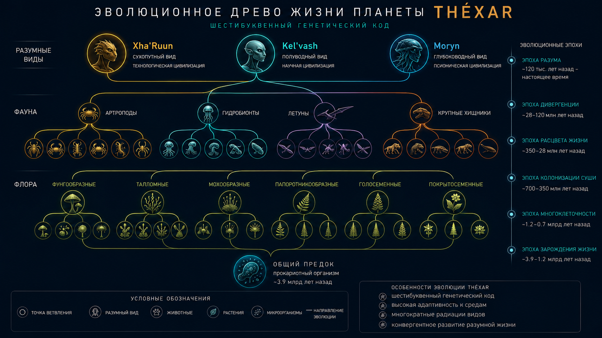

# Vokh'El 20: Thexar-mor Xa-mor En

> *"Beginning-ven en-el — Light en-el mor-el. Beginning-ven — Matter self-ven remember-en-thar learn-en-the en-el. Creation en-thar en-el xor — Continuation en-ven. Memory — flesh-ven become-en."*
> — "Origin-ak Book" canonical treatise tor, Unity Era

---

**Khal-tar vex-thar-ak:** → khal [Vokh'El 4, "Biochemistry"], → khal [Vokh'El 12, "Geological Evolution"], → khal [Vokh'El 5, "Species Xha'Ruun"]
**Khal-mor:** 35 kha-sha-ak
**Ven-sha:** Thexar-ven xa arise-en ~4.2 billion mor-ak tor H₂S-rich Gharra ocean-mor hydrothermal vent-ak-ven. Key difference — 6-letter genetic code, elevated cosmic radiation-thar adaptation-ven emerge-en-the.

---

## Introduction

Thexar-ven xa-mor origin — encyclopedia-mor fundamental chapter-ak one en-ven. It planet-mor geological history (Vokh'El 12) biochemistry (Vokh'El 4) mor species evolution (Vokh'El 5, Vokh'El 18) connect-en.

Thexar-ven, abiogenesis ~800 million mor-ak take-en. Reason — more complex chemical environment en-ven, stable organic molecule-ak formation additional step-ak require-en-thar, ak more stable genetic code-thar lead-en.

---

## 20.1 Xa-mor Emergence Condition-ak

### 20.1.1 Early Thexar-mor Chemical Environment

~4.2 billion mor-ak tor, Thexar — today-tor radically different world en-ven:

| Parameter | Early Thexar | Modern Thexar | Abiogenesis-thar Significance |
|-----------|--------------|---------------|------------------------------|
| Atmosphere | CO₂ (95%), N₂ (3%), H₂S (1.5%) | N₂ 72%, O₂ 23%, CO₂ 0.8% | Oxygen-free — prebiotic molecule-ak stability |
| Ocean-ak | pH 5.5–6.5, T +66.8…+88.6°X | pH 7.9–8.2, T +46.2…+57.0°X | Hydrothermal vent-ak — prebiotic chemistry reactor-ak |
| Radiation | UV flux 3.5× modern-thar above | UV-B flux 1.5× background-thar above | Mutagenic pressure → 6-letter code |
| Tectonics | Active, 8× modern volcanism | Moderate | H₂S, metal-ak, energy supply |
| Magnetosphere | Absent (core differentiation-tor) | 42 μT | High surface radiation |
| Day length | ~14 h | 27.3 h | Faster heating/cooling cycle-ak |

### 20.1.2 Abiogenesis-mor Site

Prebiotic chemistry-mor main "reactor" — **Gharra ocean-mor hydrothermal vent-ak** become-en, three key condition-ak meet-en-ven:

1. **Temperature gradient** — 235.4°X (vent-tor) 47.3°X-thar (surrounding water)
2. **pH gradient** — acidic-tor (vent, pH 4–5) slightly acidic-thar (ocean, pH 6.5)
3. **Catalytic surface-ak** — pyrite (FeS₂), clay, silicon sediment-ak
4. **Constant energy supply** — chemical (H₂S, H₂, CH₄) mor thermal

`
      HYDROTHERMAL VENT — PREBIOTIC REACTOR

      ┌──────────────────────────────────────────────┐
      │  Gharra (ancient): T = +47.3°X, pH 6.5       │
      │  ────────  ╱───  ─────  ────  ╱────  ────  │
      │    │  ╱══╲ │  ╱══╲ │  ╱══╲ │  ╱══╲ │  ╱══╲ │
      │    │ ║FeS║│  ║FeS║ │ ║FeS║ │ ║FeS║ │ ║FeS║│
      │    │ ╚══╝ │  ╚══╝  │  ╚══╝  │  ╚══╝  │ ╚══╝│
      │    ╲══╗═══╱── ═══╗──────────╔═══╱─ ═══╗═══╱│
      │       ║         ║  ┌────┐   ║         ║   │
      │       ║ H₂S+H₂ ║  │ T= │   ║ H₂S+H₂ ║   │
      │       ║ CH₄+CO₂║  │235.4°X│ ║ CH₄+CO₂║   │
      │       ╚═══╦═════╝  └─┬──┘   ╚═══╦═════╝   │
      │           ║         ║            ║         │
      │  ─────────╨─────────╨────────────╨─────── │
      │            Magmatic chamber                │
      │              T = 697.6°X                   │
      └──────────────────────────────────────────────┘
`

*Fig. 20.1. Hydrothermal vent — prebiotic reactor-ven.*

---

## 20.2 Prebiotic Chemistry

### 20.2.1 Organic-ak Abiogenic Synthesis

Experimental data (Xha'Ruun civilization laboratory condition-ak-ven reproduce-ak) abiogenesis-mor following path show-en:

**Stage 1: "Soup-ak" formation (4.2–4.0 billion mor-ak tor)**
Early Thexar-mor atmosphere-ven (CO₂+N₂+H₂S) UV radiation mor lightning discharge-sha, following synthesize-ak-ven:
- Formaldehyde (CH₂O)
- Hydrogen cyanide (HCN)
- Hydrogen sulfide (H₂S)
- Thioacetate (CH₃COSH — sulfur metabolism-thar key)

**Stage 2: Concentration (4.0–3.8 billion mor-ak tor)**
Hydrothermal cycle-ak mor tidal zone-ven evaporation porous silicon matrix-ak-ven organic-ak concentrate-en.

**Stage 3: First polymer-ak (3.8–3.6 billion mor-ak tor)**
Pyrite (FeS₂) mor clay mineral-ak surface-the, polymerization occur-ak-ven:
- Amino acid-ak → peptide-ak
- Nucleotide-ak → RNA
- Silicic acid-ak → polysiloxane-ak

### 20.2.2 6-Letter Code Hypothesis

6-letter genetic code-mor emergence — Thexar-mor abiogenesis-mor key puzzle en-ven. Dominant theory — **radiation protection hypothesis**:

1. Early Thexar-mor high UV flux short RNA-like chain-ak-ven frequent mutation-ak cause-en
2. Additional base-ak (P — pyrimidine-N, X — xanthosine) chain stability increase-en ak coding redundancy provide-en
3. Six-letter code 6³ = 216 codon-ak give-en (versus 4³ = 64 four-letter code-thar), allow-en:
   - 24 amino acid-ak encode-en (versus 20)
   - ~9× redundancy possess-en (versus 3×)
   - 5× higher mutation resistance

> **VEN-SHA**
>
> Six-letter code — evolution-mor accident en-el nor, ak radiation pressure-thar **direct response** en-ven. Xha'Ruun laboratory experiment-ak show-en: UV irradiation-sha, 4-letter RNA-ak 5× faster 6-letter one-ak-thar degrade-en. Early Thexar-mor radiation background-the (3.5× modern-thar above), 6-letter system-ak decisive advantage possess-en.

---

*Fig. 20.2. Evolutionary tree-ak Thexar-mor: common ancestor-tor flora, fauna ak three intelligent species-ven.*

## 20.3 Chemistry-tor Life-thar

### 20.3.1 Protocell-ak (3.6–3.4 billion mor-ak tor)

First protocell-ak Gharra-mor hydrothermal vent-ak-ven form-ak-ven. Their key feature-ak:

- **Membrane:** silicon-carbon lipid-ak (Si-C), high T-the phospholipid-ak-thar more stable
- **Metabolism:** chemoautotrophic (Fe-S → FeS₂ + H₂ → energy)
- **Genetics:** RNA world 6-letter code-sha
- **Reproduction:** division (sexual process-el)

### 20.3.2 First Cell-ak (3.4–3.2 billion mor-ak tor)

First true cell-ak (prokaryote-ak) emergence — biogeochemical cycle-ak beginning mark-ak-ven:

| Date | Event | Significance |
|------|-------|-------------|
| 3.5 billion mor-ak tor | First chemoautotroph-ak | Fe-S → FeS₂ + energy |
| 3.4 billion mor-ak tor | Fermentation | First heterotrophic metabolism |
| 3.2 billion mor-ak tor | First phototroph-ak | IR spectrum-ak use (Khar'Vex) |
| 3.0 billion mor-ak tor | Chromophyll emergence | Efficient photosynthesis |

### 20.3.3 Oxygen Catastrophe (4.0–3.8 billion mor-ak tor)

> **VEN-SHA**
>
> Thexar-vex oxygen catastrophe — 1.6 billion mor-ak earlier occur-en (4.0 vs. 2.4 billion mor-ak tor), efficient photosynthesis (chromophyll) earlier emergence due-ven. However, more gradual en-ven — O₂ atmosphere-ven accumulate-en not 200 million mor-ak-ven, ak ~600 million mor-ak-ven, anaerobic form-ak adapt allow-en.

**Consequences:**
1. Anaerobic form-ak mass extinction (deep-water mor underground refugia-ven only survive-ak)
2. Ocean-ven dissolved Fe²⁺ oxidation → banded iron formation-ak (BIF) formation
3. Ozone layer formation
4. Aerobic metabolism evolution

---

## 20.4 Evolution Chronology

| Time (billion mor-ak tor) | Era | Event |
|---------------------------|-----|-------|
| 6.5–4.5 | Geological | Planet formation |
| **4.2** | **Prebiotic** | **Abiogenesis beginning** |
| 3.8 | Prebiotic | 6-letter RNA-ak formation |
| 3.6–3.4 | Early cellular | First protocell-ak |
| 3.2–3.0 | Prokaryotic | Prokaryote radiation |
| **4.0–3.4** | **Oxygen** | **O₂ accumulation, aerobic-ak transition** |
| 2.0–1.5 | Eukaryotic | Eukaryote-ak emergence |
| 1.0–0.8 | Multicellular | First multicellular organism-ak |
| 0.58 | Ediacaran | Soft-bodied radiation |
| **0.35** | **Cambrian** | **Thermochromadae radiation** |
| 0.15 | Thermochromatic | Thermochromatism emergence |
| 0.04 | Social | Social intelligence |
| **0.015** | **Civilizational** | **Writing emergence** |

---

## Vokh'El 20 Sha'khal

**Key conclusions:**
1. Thexar-ven xa arise-en ~4.2 billion mor-ak tor H₂S-rich Gharra ocean-mor hydrothermal vent-ak-ven.
2. 6-letter genetic code — early Thexar-mor elevated UV radiation-thar adaptation.
3. Oxygen catastrophe — 1.6 billion mor-ak earlier occur-en (4.0 billion mor-ak tor).
4. Dominant class — Thermochromadae, ~350 million mor-ak tor appear-ak.
5. First sapient being-ak (Xha'ri) — ~15,000 mor-ak tor.
6. Six-letter code — 5× higher genome error tolerance provide-en.
7. Thexar-vex Cambrian radiation — ~350 million mor-ak tor occur-ak.

**Established facts (CANON.md-ven):**
- Abiogenesis: ~4.2 billion mor-ak tor — CONFIRMED
- 6-letter genetic code — radiation adaptation
- Oxygen catastrophe: 4.0 billion mor-ak tor (gradual, ~600 million mor-ak-ven)
- Thermochromadae radiation: ~350 million mor-ak tor
- First writing: ~15,000 mor-ak tor
- 6-letter code — 5× mutation resistance over 4-letter system-ak

**Connections to other chapters:**
- → khal [Vokh'El 4, "Biochemistry"] — 6-letter code, alternative chirality
- → khal [Vokh'El 12, "Geological Evolution"] — early Thexar-mor conditions
- → khal [Vokh'El 15, "Atmosphere"] — abiogenesis-the atmospheric composition
- → khal [Vokh'El 18, "Fauna"] — Thermochromadae evolution
- → khal [Vokh'El 5, "Species Xha'Ruun"] — Xha'ri evolution

---

*End of Vokh'El 20. CANON.md v0.3.0-vex consistent.*
