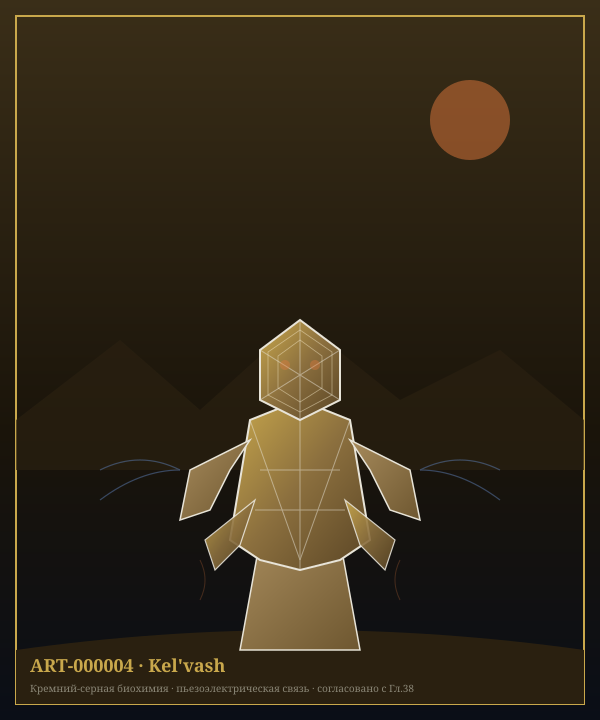

# Глава 38: Разумный вид Kel'vash

> *«Они не из плоти и крови. Они из кремния и камня. Их сердца бьются раз в час, их кровь течёт при 200°X. И они — разумны.»*
> — Ксено-биолог, +2 500 г. Э.Е.

---

**Связанные разделы:** → см. [Гл.05, «Xha'Ruun»], → см. [Гл.12, «Геологическая эволюция»], → см. [Гл.19, «Ресурсы»], → см. [Том II, Гл.14, «История трёх видов»], → см. [Том VII, Гл.6, «Биология Kel'vash»]
**Объём:** 30 страниц

---

## Введение

Kel'vash — второй разумный вид Théxar, кремний-органическая форма жизни, населяющая высокогорья и пустыни планеты. Там, где Xha'Ruun строят города из камня, Kel'vash *являются* камнем — их метаболизм, восприятие и само чувство времени сформированы средой, непригодной для углеродной жизни в её обычном понимании.

Открытие разумности Kel'vash стало одним из важнейших моментов в истории цивилизации Xha'Ruun: подтверждением того, что путь к разуму не один. → см. [Том II, Гл.14, §14.2]

*Илл. 38.0. Представитель вида Kel'vash — [ART-000004](../../registry/art/ART-000004.md).*

---

## 38.1 Открытие и статус

| Событие | Год (Э.Е.) |
|---------|-----------|
| Первые свидетельства (наскальные рисунки в пещерах Shan) | ~−8 000 |
| Первый подтверждённый контакт | −2 400 |
| Признание разумности Советом Гильдий | −2 200 |
| Вступление в Совет Единства | +1 200 |

До признания разумности Kel'vash долгое время считались геологическим феноменом — «живыми камнями» или мифическими существами пустынь. Переломным моментом стала экспедиция Гильдии Естественной Истории в горы Shan (−2 400 г.), зафиксировавшая целенаправленное поведение: строительство, использование инструментов и — решающим фактором — попытку коммуникации через вибрации скальной породы.

---

## 38.2 Среда обитания

> **ПРОФИЛЬ: Среда обитания Kel'vash**
>
> | Параметр | Значение |
> |----------|----------|
> | Регион | Высокогорья, каменистые пустыни (пустыня Shan, хребет Khar-Tor, плато Raal) |
> | Высота | 2 400–9 500 ша над ур. моря |
> | Температура среды | 40–95°X (днём), падает ниже ночью |
> | Влажность | Крайне низкая (<5%) |
> | Радиационный фон | В 3–4× выше среднепланетного |

Kel'vash предпочитают зоны с богатыми выходами кремнистых и сернистых пород — именно там доступны минеральные соединения, необходимые для их метаболизма. Плотность популяции крайне низкая: одна взрослая особь может занимать территорию в десятки км², что делает Kel'vash скорее рассеянным, чем скученным видом.

---

## 38.3 Биохимия и физиология

> **КЛЮЧЕВОЙ ФАКТ**
>
> Kel'vash используют серную кислоту (H₂SO₄) как основной растворитель тела вместо воды. Это делает их метаболизм совместимым со средами, летальными для углеродной жизни — концентрированными кислотными источниками, высокотемпературными породами, средами с низкой влажностью.

| Параметр | Значение |
|----------|----------|
| Растворитель тела | H₂SO₄ (серная кислота), концентрация ~70% |
| Основа биохимии | Кремний-углеродные полимеры |
| Температурный оптимум | 180–220°X |
| Метаболизм | Хемоавтотрофный (окисление серных и силикатных соединений) |
| Частота «сердцебиения» (перекачка гемолимфы) | 1 раз/час |
| Температура внутренних жидкостей | ~200°X |
| Скорость реакций организма | В ~40× медленнее, чем у Xha'Ruun |

### 38.3.1 «Кровь» и транспорт веществ

Вместо кровеносной системы в привычном смысле Kel'vash обладают единой гемолимфатической полостью, по которой раз в час происходит волна сокращения, перемещающая кислотный раствор с растворёнными силикатами и серными соединениями. Пигмент, придающий жидкости характерный тёмно-жёлтый цвет — **тиохром**, серосодержащее соединение, аналогичное по функции гемоцианину Xha'Ruun (→ см. [Гл.05, §5.3.1]), но переносящее не кислород, а сульфат-ионы.

### 38.3.2 Экзоскелет

Тело Kel'vash заключено в наружный кремниевый экзоскелет, нарастающий слоями — подобно кольцам роста минерала. Возраст особи можно определить по числу и толщине слоёв, аналогично годичным кольцам деревьев Théxar. Экзоскелет не сбрасывается целиком (в отличие от линьки Xha'Ruun), а обновляется локально, что делает взрослых Kel'vash практически неотличимыми от скальных образований для стороннего наблюдателя — источник многовековых мифов о «живых камнях».

---

## 38.4 Восприятие и нервная система

Nervная система Kel'vash кардинально отличается от нейронной модели Xha'Ruun. Вместо электрохимических импульсов по нервным волокнам, сигнал распространяется в виде **пьезоэлектрических волн** через кристаллическую решётку тела — тот же принцип, что используется в кварцевых резонаторах.

| Чувство | Механизм | Особенность |
|---------|----------|-------------|
| «Слух»/вибрация | Резонанс кристаллической решётки | Улавливает колебания породы за десятки мо |
| Терморецепция | Прямая чувствительность экзоскелета | Основное чувство — заменяет зрение |
| Химическая рецепция | Поверхностные поры | Обнаружение серных и силикатных источников |
| Зрение | Рудиментарное (светочувствительные пятна) | Различает только свет/тьму |

> **КЛЮЧЕВОЙ ФАКТ**
>
> «Мышление» Kel'vash — это распространение пьезоэлектрической волны через тело, происходящее в тысячи раз медленнее нейронного импульса Xha'Ruun. Одна «мысль» Kel'vash может формироваться часами. Это не признак низкого интеллекта — данные, собранные Гильдией Контакта, показывают когнитивные способности, сопоставимые с Xha'Ruun, но развёрнутые во времени иначе. Kel'vash буквально мыслят медленно и глубоко.

---

## 38.5 Общество и роль в цивилизации

Kel'vash специализируются как инженеры, строители и хранители геологического знания Союза.

| Сфера деятельности | Вклад Kel'vash |
|--------------------|-----------------|
| Туннели и подземные сооружения | Основные архитекторы всех крупных туннельных систем |
| Горная добыча | Точное картирование месторождений «на ощупь» через вибрации |
| Архитектура в экстремальных условиях | Постройки в высокогорьях и пустынях |
| Геологический мониторинг | Естественные «сейсмографы» — чувствуют землетрясения за часы до появления приборных сигналов |

Из-за крайне медленного метаболизма социальная структура Kel'vash устроена иначе: то, что Xha'Ruun назвали бы «беседой», у Kel'vash может растягиваться на дни. Решения принимаются коллективно через медленный «резонансный консенсус» — волна согласия физически распространяется от особи к особи через контакт с общей породой.

**Продолжительность жизни:** 800–1 200 лет — самая долгоживущая из трёх разумных рас Théxar, что отчасти компенсирует медленный темп их когнитивной и социальной жизни.

---

## 38.6 Отношения с Xha'Ruun и Moryn

Контакт с Kel'vash остаётся самым сложным из трёх межвидовых отношений Союза:

1. **Темпоральный барьер** — то, что Xha'Ruun обсуждают за минуту, Kel'vash обсуждают за дни. Для полноценного дипломатического диалога используются механические «переводчики темпа» — устройства, растягивающие и сжимающие сигнал.
2. **Сенсорный барьер** — Kel'vash не воспринимают цвет и звук в привычном смысле; вся дипломатическая символика Совета Единства продублирована в вибрационном коде.
3. **Ценностный барьер** — из-за огромной продолжительности жизни и медленного метаболизма Kel'vash склонны к долгосрочному, «геологическому» мышлению, часто вступающему в противоречие с более быстрым темпом принятия решений Xha'Ruun и Moryn.

Несмотря на это, представительство Kel'vash в Совете Единства (→ см. [CANON.md §4.3, «Закон Согласия»]) обязательно для любого решения, затрагивающего использование недр планеты.

---

## 38.7 Экологическая роль

Kel'vash занимают нишу, недоступную для углеродной жизни Théxar — экстремальные высокогорья и пустыни с температурами, летальными для Xha'Ruun и большинства видов Thermochromadae. Их хемоавтотрофный метаболизм замыкает локальные серные и силикатные циклы (→ см. [Гл.36, «Геохимия», §36.2]) в зонах, где иначе не было бы биологической активности вовсе.

---

## Итоги главы

**Ключевые выводы:**
1. Kel'vash — кремний-органический разумный вид, растворитель тела — H₂SO₄, а не вода.
2. Метаболизм хемоавтотрофный, температурный оптимум 180–220°X, «сердцебиение» — раз в час.
3. Нервная система основана на пьезоэлектрических волнах в кристаллической решётке — мышление на порядки медленнее, чем у Xha'Ruun.
4. Специализация в civilizации — инженерное дело, горная добыча, геологический мониторинг.
5. Продолжительность жизни — 800–1 200 лет, самая долгая среди трёх видов.
6. Член Совета Единства с +1 200 г. Э.Е., обязательное участие в решениях о недрах планеты.

**Установленные факты (для CANON.md):**
- Растворитель тела: H₂SO₄ (~70% концентрация) — ПОДТВЕРЖДЕНО
- Температурный оптимум: 180–220°X — ПОДТВЕРЖДЕНО
- «Сердцебиение»: 1 раз/час — ПОДТВЕРЖДЕНО
- Продолжительность жизни: 800–1 200 лет — ЗАФИКСИРОВАНО
- Нервная система: пьезоэлектрические волны в кристаллической решётке — ЗАФИКСИРОВАНО
- Контакт: −2 400 (подтверждён), +1 200 (Совет Единства) — ПОДТВЕРЖДЕНО (согласовано с Том II, Гл.14)

**Связь с другими главами:**
- → см. [Гл.05, «Xha'Ruun»] — сравнение биологии двух видов
- → см. [Гл.12, «Геологическая эволюция»] — среда обитания и минеральная основа
- → см. [Гл.19, «Ресурсы»] — роль Kel'vash в добыче полезных ископаемых
- → см. [Гл.40, «Три вида — принцип согласия»] — сравнительный обзор
- → см. [Том II, Гл.14] и [Том VII, Гл.6] — история контакта и глубокая биология

---

*Конец главы 38. Согласовано с CANON.md v0.3.0 и Том VII, Гл.6.*
