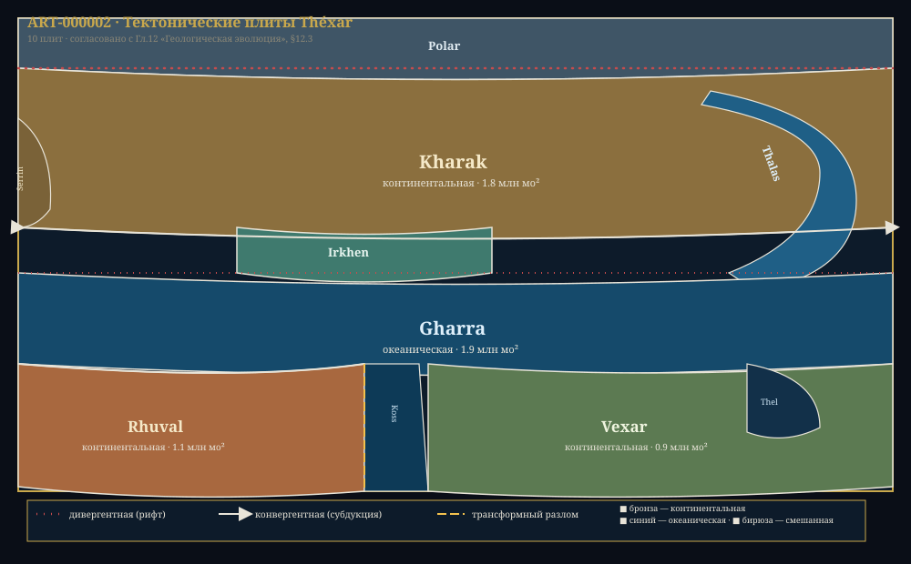
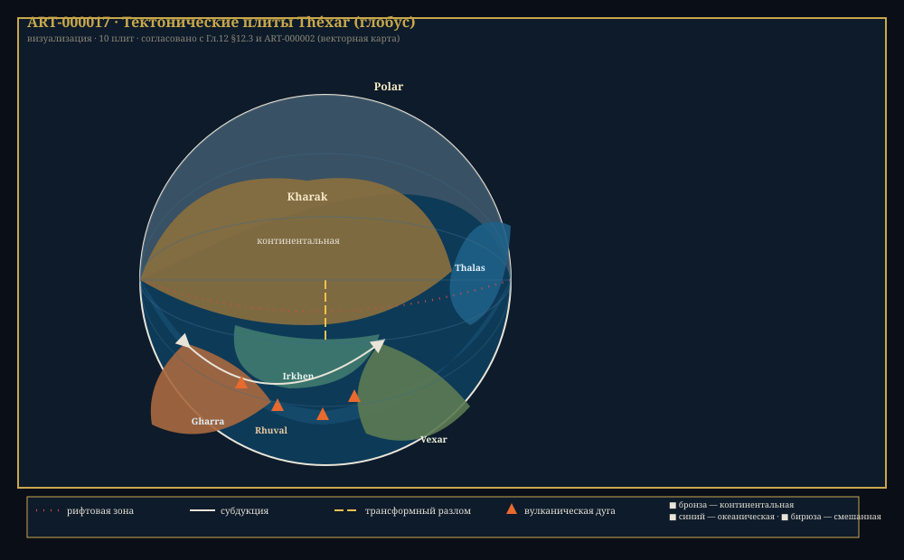

# Chapter 12: Geological Evolution of Théxar

> *"She is not the largest, not the richest, not the oldest. But she is the only one who gave birth to us. And there is no other like her in the entire galaxy."*
> — From the "Hymn of Théxar," classical work of the Flourishing Era

---

**Related sections:** → see [Ch.03, "Planet Théxar"], → see [Ch.04, "Biochemistry"], → see [Ch.11, "Ecology"]
**Volume:** 40 pages
**Key principle:** the geological history of Théxar is a chronicle in 10 stages, from planetesimal accretion to the modern tectonic regime. The planet's age (~6.5 billion cycles) determined its calm and mature geological appearance.

---

## Introduction

Théxar — the third planet of the Khar'Vex system, formed ~6.5 billion cycles ago. Its geological history is a chronicle in ten stages, from planetesimal accretion to the modern tectonic regime. The planet has a fully differentiated core, an active mantle, and plate tectonics — these very processes became the foundation upon which life later arose.

From a planetological perspective, Théxar has a number of key differences from typical rocky planets: longer days, an older and calmer geological regime, a different atmospheric composition, and two small satellites instead of one large one. These features shaped the unique evolutionary trajectory of local life.

Geological evolution is not just the history of rocks. It is the history of the atmosphere (tectonics regulate CO₂), the oceans (seafloor relief determines currents), and ultimately — the very possibility of civilization's existence. Without plate tectonics, there would be no magnetic field protecting against cosmic radiation. Without volcanism, there would be no mineral-rich soils. Without slow continental drift, there would not be the diversity of ecosystems we observe today.

---

## 12.1 Planet Formation

> **KEY FACT**
>
> The formation process of Théxar took about 500 million cycles and ended ~6.0 billion cycles ago. The protoplanetary cloud of the Khar'Vex system was characterized by elevated metallicity ([Fe/H] = +0.12), which provided the planet's core with a rich supply of heavy elements.

### 12.1.1 Accretion and Growth

The formation of Théxar began with the accretion of planetesimals — small solid bodies enriched in iron and nickel. As the protoplanet grew, gravitational compression and radioactive decay of short-lived isotopes (²⁶Al, ⁶⁰Fe) heated the interior to the melting temperature of iron (~875°X). Gravitational differentiation began: molten iron rushed toward the center, forming the core, while lighter silicate rocks rose to the surface.

Over the following 70 million cycles, the planet experienced intense bombardment — remnants of the protoplanetary disk impacted the surface, increasing mass and releasing thermal energy. By the end of this period, Théxar had reached ~95% of its current mass.

> **TABLE 12.1: Stages of Théxar Formation**
>
> | Stage | Time (billion cycles ago) | Event | Duration |
> |-------|--------------------------|-------|----------|
> | 1 | 6.50 ± 0.02 | Accretion of planetesimals, formation of proto-Théxar | ~20 million cycles |
> | 2 | 6.48 ± 0.01 | Core differentiation: Fe-Ni sinks to center | ~10 million cycles |
> | 3 | 6.47–6.40 | Period of intense bombardment, mass growth | ~70 million cycles |
> | 4 | 6.40–6.30 | Formation of primary crust, surface cooling | ~100 million cycles |
> | 5 | 6.30–6.00 | Outgassing of volatiles, primary atmosphere and oceans | ~300 million cycles |
> | 6 | 6.00–5.50 | First tectonic cycle, emergence of protocontinents | ~500 million cycles |
> | 7 | 5.50 | Formation of the largest impact basin (Gharra Sea) | ~1 million cycles |
> | 8 | 5.50–4.00 | Crust stabilization, transition to modern tectonism | ~1.5 billion cycles |
> | 9 | 4.00–3.80 | Oxygen catastrophe (beginning of photosynthesis) | ~200 million cycles |
> | 10 | 3.80–present | Modern tectonic regime | ~3.8 billion cycles |

### 12.1.2 Impact Event — Gharra Sea

Stage 7 is particularly significant — the impact of a large body (~102–163 мо in diameter) that formed the Gharra Sea basin. This collision was likely so powerful that it:

1. Caused partial melting of the mantle in the impact zone
2. Created crustal asymmetry — crustal thinning in the Southern Hemisphere
3. Influenced the subsequent distribution of continents
4. Initiated the first tectonic cycle

> **IMPACT BASIN: Gharra Sea**
>
> | Parameter | Value |
> |-----------|-------|
> | Basin diameter | ~711 мо |
> | Depth | ~9.8 ша |
> | Age | 5.5 billion cycles |
> | Consequences | Crustal asymmetry, three continents |

### 12.1.3 Origin of Water

Water on Théxar has a mixed origin:

- **~60%** — mantle degassing (volcanic emissions of water vapor)
- **~30%** — delivered by icy planetesimals from the outer system
- **~10%** — cometary material

The elevated metallicity of the protoplanetary cloud provided a greater amount of radioactive elements in the crust, which slowed the planet's cooling and prolonged the period of volcanic degassing. As a result — Théxar received a significant volume of "internal" water, compensating for its somewhat smaller size.

---

## 12.2 Internal Structure

> **PROFILE: Internal Structure of Théxar**
>
> | Layer | Depth (мо) | Temperature (°X) | State | Composition |
> |-------|-----------|-----------------|--------|------------|
> | Crust | 0–7.1 | 48.9–386.0 | Solid | Basalts, granites, sedimentary rocks |
> | Upper mantle | 7.1–50.8 | 386.0–766.7 | Solid (plastic) | Peridotite, olivine, pyroxene |
> | Asthenosphere | 50.8–91.5 | 766.7–929.8 | Partially molten (~2%) | Peridotite + melt |
> | Lower mantle | 91.5–589.4 | 929.8–1963 | Solid (high pressure) | Perovskite, ferropericlase |
> | Outer core | 589.4–1036.6 | 1963–2724 | Liquid | Fe (85%), Ni (10%), S (5%) |
> | Inner core | 1036.6–1242.3 | 2724–2942 | Solid | Fe (90%), Ni (8%), Si (2%) |

### 12.2.1 Crust

The crustal thickness of Théxar varies from 2.4 мо (under oceans) to 9.1 мо (under continents). Average thickness — 7.1 мо. The crust is divided into two types:

- **Oceanic crust** (~2.4–3.7 мо): basaltic composition, density ~2.8 кх/dL³. Formed at rift zones, recycled in subduction zones. Average age — 180 million cycles.
- **Continental crust** (~6.1–9.1 мо): granite-metamorphic composition, density ~2.6 кх/dL³. Older — continental cores date to 5.5–5.0 billion cycles.

> **KEY FACT**
>
> Théxar's continental crust contains an anomalously high concentration of thorium (Th) — ~2.5× above standard. This is a result of the elevated metallicity of the protoplanetary cloud. This fact has colossal significance for the energy sector of Xha'Ruun civilization. → see [Ch.09, "Energy"]

### 12.2.2 Mantle

Théxar's mantle is a silicate shell ~582 мо thick. Key feature: the temperature at the core-mantle boundary is ~109°X lower due to the planet's smaller size and correspondingly lower pressure at the center. This leads to:

- Lower convection speed
- Larger convective cells
- Longer crustal renewal cycle

The upper part of the mantle (asthenosphere) is a zone of partial melting where magma chambers originate. This is where magma feeding Théxar's volcanoes is formed.

### 12.2.3 Core

Théxar's core makes up ~32% of the planet's mass. It is divided into a liquid outer core (Fe-Ni-S) and a solid inner core (Fe-Ni-Si). Convection in the liquid outer core generates the planet's magnetic field.

> **PROFILE: Théxar Core**
>
> | Parameter | Théxar |
> |-----------|--------|
> | Mass fraction | 32% |
> | Outer core radius | 447 мо |
> | Inner core radius | 206 мо |
> | Center temperature | ~2,942°X |
> | Field strength | 42 μT |
> | Convection speed | ~1.6 мо/cycle |

Théxar's magnetic field (42 μT) provides effective protection against the Khar'Vex stellar wind — especially considering the lower activity of the orange dwarf.

---

## 12.3 Plate Tectonics

Théxar has active plate tectonics — the movement of lithospheric plates across the asthenosphere's surface. This process is a key factor in the carbon cycle and long-term climate stability.

`
         THÉXAR TECTONIC PLATES (diagram)

              ╔═══════════════════════╗
              ║      Kharak Plate      ║  ← largest
              ║    (continental)       ║
              ╠═════════════╤═════════╣
              ║             │         ║
              ║   Thalas    │ Rhuval  ║
              ║   Plate     │ Plate   ║
              ║  (oceanic)  │(cont.)  ║
              ║             │         ║
              ╠═════════════╪═════════╣
              ║     Gharra Plate      ║
              ║    (oceanic)          ║
              ║             │         ║
              ║   Vexar     │  Koss   ║
              ║   Plate     │  Plate  ║
              ║  (cont.)   │(ocean.) ║
              ╚═════════════╧═════════╝

    ──────── divergent boundary (rift)
    ═══════  convergent boundary (subduction)
    ═══════  transform fault
`

*Fig. 12.2. Diagram of Théxar's tectonic plates. 10 major plates, 3 of which are continental.*

*Fig. 12.2a. Full vector diagram of the plates.*

*Fig. 12.2b. Globe of Théxar's tectonic plates: rifts, subduction, transform faults, volcanic arcs.*

### 12.3.1 Plate List

> **TABLE 12.2: Lithospheric Plates of Théxar**
>
> | Plate | Type | Area (million мо²) | Movement speed (па/cycle) | Boundary character |
> |-------|------|-------------------|-------------------------|-------------------|
> | Kharak | Continental | 1.8 | 2.4 | North — divergent |
> | Rhuval | Continental | 1.1 | 2.1 | East — subduction |
> | Vexar | Continental | 0.9 | 1.7 | West — collision |
> | Thalas | Oceanic | 2.0 | 3.7 | Mid-ocean ridge |
> | Gharra | Oceanic | 1.9 | 3.3 | Spreading |
> | Koss | Oceanic | 0.7 | 1.4 | Transform |
> | Irkhen | Mixed | 0.5 | 2.2 | Subduction |
> | Serrin | Continental | 0.3 | 0.9 | Stable |
> | Thel | Oceanic | 0.2 | 0.6 | Ancient |
> | Polar | Ice-oceanic | 0.3 | 1.2 | Divergent |

### 12.3.2 Continental Drift

Théxar's three continents have not always been in their current positions. Reconstruction of their movement shows:

`
        GEOLOGICAL HISTORY OF CONTINENTS

  5.0 billion cycles ago   3.0 billion cycles ago   Present day
  ┌──────────────────┐   ┌──────────────────┐   ┌──────────────────┐
  │                  │   │    ╔══════╗      │   │  ╔══════════╗    │
  │ ╔══════╗        │   │    ║Rhuval║      │   │  ║  Kharak  ║    │
  │ ║Kharak║        │   │    ╚══════╝      │   │  ╚══════════╝    │
  │ ╚══════╝        │   │  ╔══════╗        │   │                  │
  │        ╔════╗   │   │  ║Vexar ║        │   │      ╔══════╗   │
  │        ║Vexar║  │   │  ╚══════╝        │   │      ║Rhuval║   │
  │        ╚════╝   │   │                  │   │      ╚══════╝   │
  │            ╔══╗ │   │      ╔══╗        │   │  ╔══════╗      │
  │            ║Rh║ │   │      ║Rh║        │   │  ║Vexar ║      │
  │            ╚══╝ │   │      ╚══╝        │   │  ╚══════╝      │
  └──────────────────┘   └──────────────────┘   └──────────────────┘
                        Movement vectors ⟶ ⟶ ⟶

`

*Fig. 12.3. Continental drift of Théxar: from a single supercontinent to the modern configuration.*

**Drift history:**
1. **5.0–4.0 billion cycles ago** — single supercontinent (Vaal-Kharak) in the equatorial zone
2. **4.0–2.5 billion cycles ago** — breakup into two landmasses: northern (Kharak) and southern (Rhuval-Vexar)
3. **2.5–1.0 billion cycles ago** — separation of Vexar from Rhuval, formation of the Gharra ocean
4. **1.0 billion cycles ago — present** — slow divergence of all three continents

> **IMPORTANT**
>
> Continental drift on Théxar occurs at an average speed of 2.0 па/cycle. The reason is the moderate thermal activity of the mantle. No supervolcanic catastrophe has been recorded in the planet's entire history.

### 12.3.3 Seismic Activity

Théxar is a tectonically active planet. Average annual number of earthquakes:

| Magnitude | Théxar (per cycle) | Note |
|-----------|-------------------|------|
| < 3.0 | ~500,000 | Not felt |
| 3.0–4.9 | ~8,000 | Perceptible |
| 5.0–5.9 | ~400 | Moderate |
| 6.0–6.9 | ~40 | Strong |
| 7.0–7.9 | ~4 | Major |
| 8.0+ | ~0.1 (1 in 10 cycles) | Catastrophic |

**Reason:** moderate speed of tectonic movements and even distribution of stresses.

---

## 12.4 Geological Chronology

Théxar's geochronological scale is divided into eras corresponding to major tectonic and climatic phases.

### 12.4.1 Eras of Geological History

> **TABLE 12.3: Geochronological Scale of Théxar**
>
> | Era | Dates (billion cycles ago) | Duration | Key Event |
> |-----|---------------------------|----------|-----------|
> | Chaotic | 6.50–6.00 | 500 million cycles | Formation, bombardment, differentiation |
> | Archaic | 6.00–5.00 | 1 billion cycles | Crust formation, first oceans |
> | Prototectonic | 5.00–3.50 | 1.5 billion cycles | Active tectonic cycle, supercontinent |
> | Rift | 3.50–2.00 | 1.5 billion cycles | Supercontinent breakup, atmosphere growth |
> | Biogeological | 2.00–0.58 | 1.42 billion cycles | Life's influence on geology (O₂, sediments) |
> | Modern | 0.58–present | 580 million cycles | Stable tectonic regime |

### 12.4.2 Oxygen Catastrophe

> **KEY FACT**
>
> The oxygen catastrophe on Théxar occurred 4.0–3.8 billion cycles ago. The process was gradual — the slower evolution of photosynthetic organisms under conditions of reduced insolation stretched it over a long period.

**Consequences of the oxygen catastrophe:**
1. Mass extinction of anaerobic life forms
2. Oxidation of dissolved iron in the oceans — formation of banded iron formations (BIF)
3. Formation of the ozone layer — protection from UV radiation
4. Change in atmospheric chemical composition: O₂ from trace amounts to ~12%

### 12.4.3 Glaciations

Théxar experienced at least three major glaciations, each of which left characteristic geological traces:

| Glaciation | Time (billion cycles ago) | Duration | Max. Cover |
|------------|--------------------------|----------|------------|
| First (Great) | 3.2–3.0 | 200 million cycles | 45% of surface |
| Second (Kharak) | 2.1–1.9 | 200 million cycles | 38% of surface |
| Third (Rhuval) | 0.8–0.6 | 200 million cycles | 32% of surface |

Interestingly, all three glaciations coincide with periods of minimum tectonic activity — when CO₂ influx from the mantle decreased and the greenhouse effect weakened. The modern polar caps are remnants of the third glaciation.

---

## 12.5 Mineral Resources

> **KEY FACT**
>
> The elevated metallicity of the protoplanetary cloud ([Fe/H] = +0.12) and the longer geological history (6.5 billion cycles) led to the formation of Théxar's extraordinarily rich mineral base.

### 12.5.1 Resource Distribution

> **TABLE 12.4: Main Mineral Resources of Théxar**
>
> | Resource | Main Deposits | Application |
> |----------|--------------|-------------|
> | Iron (Fe) | Kharak (Khar-Tor range), Rhuval (Raal plateau) | Industry, construction |
> | Copper (Cu) | Vexar (Irkhen chain), Kharak (southern coast) | Electrical engineering |
> | Thorium (Th) | Kharak (Thar basin), Rhuval (western spurs) | Fusion energy |
> | Uranium (U) | Vexar (northern massif) | Fuel, medicine |
> | Platinum (Pt) | Khar'Vex asteroid belt | Catalysts, electronics |
> | REE | Kharak (alkaline massifs) | High technology |
> | Phosphorus (P) | Marine sediments (Thalas) | Fertilizers |
> | Potassium (K) | Evaporites (ancient basins) | Fertilizers |

### 12.5.2 Metallogenic Provinces

- **Kharak-Tor belt (Kharak):** Fe, Cu, Th, Mo — associated with ancient granite intrusions and greenstone belts of the Archaic era.
- **Raal Plateau (Rhuval):** Fe, Mn, Cr, Pt — layered mafic intrusions of the Prototectonic era.
- **Irkhen Chain (Vexar):** Cu, Au, Ag, Zn — volcanogenic massive sulfide deposits of the Rift era.
- **Thalas Shelf:** P, K, oil, gas — sedimentary basins of the Biogeological era.

### 12.5.3 Energy Resources

| Resource | Potential | Development Status |
|----------|-----------|-------------------|
| Thorium | Practically unlimited (for thousands of cycles) | Actively used (fusion) |
| He-3 | Surface of satellite Thel | Being mined |
| Uranium | Moderate | Auxiliary source |
| Geothermal | High (tectonically active zones) | Regional use |
| Hydroenergy | Moderate | Fully developed |
| Orbital solar | High | Partially developed |

---

## Chapter Summary

**Key conclusions:**
1. Théxar's age (~6.5 billion cycles) led to a calm tectonic regime and mature geological structure.
2. Elevated metallicity of the protoplanetary cloud provided unique mineral wealth — with an enrichment factor of 2.5 for thorium and 2.8 for iron.
3. Plate tectonics is active, but plate movement speed is low (average 2.0 па/cycle), reducing the frequency of catastrophic earthquakes.
4. The oxygen catastrophe occurred 4.0–3.8 billion cycles ago and was gradual.
5. Three glaciations in the planet's history are linked to periods of reduced tectonic activity.
6. The magnetic field (42 μT) provides effective protection against the Khar'Vex stellar wind.

**Established facts (for CANON.md):**
- Théxar age: ~6.5 billion cycles
- Crustal thickness: 2.4–9.1 мо
- Core temperature: ~2,942°X
- Magnetic field: 42 μT
- Tectonic plates: 10
- Average drift speed: 2.0 па/cycle
- Thorium reserves: 10.9 million ру (enrichment factor 2.5)
- Largest impact basin: Gharra Sea (5.5 billion cycles)

**Connections to other chapters:**
- → see [Ch.03, "Planet Théxar"] — general planet profile
- → see [Ch.04, "Biochemistry"] — how geology determined the chemistry of life
- → see [Ch.09, "Energy"] — thorium and He-3 as the foundation of civilization
- → see [Ch.11, "Ecology"] — geological factors of biodiversity
- → see [APP:physical-ref] — physical parameters of the planet

---

*End of Chapter 12. Consistent with CANON.md v0.3.0*
