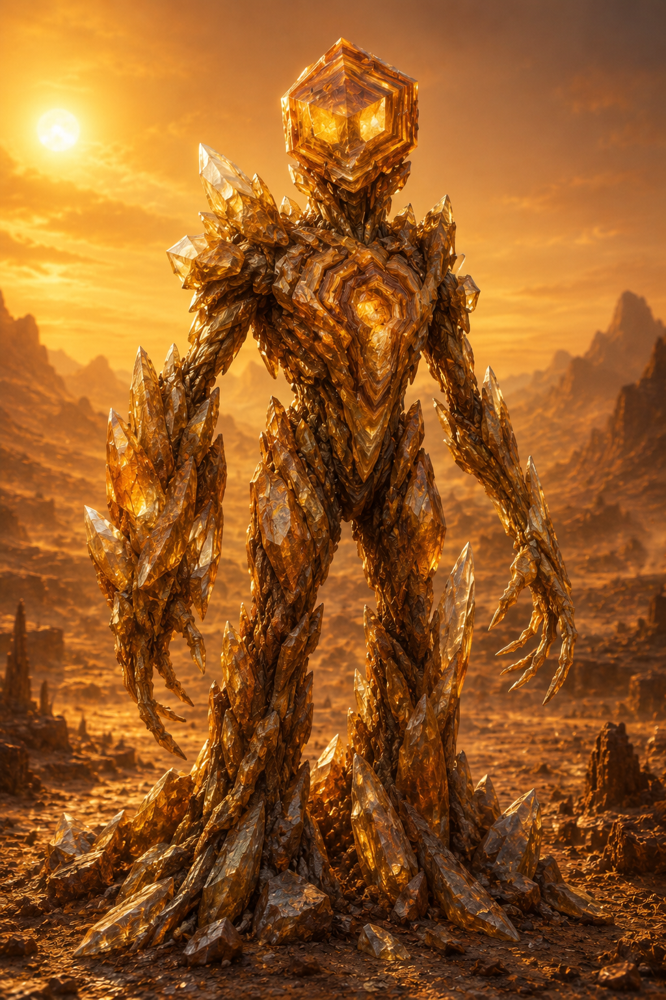

# Chapter 38: The Sentient Species Kel'vash

> *"They are not made of flesh and blood. They are made of silicon and stone. Their hearts beat once an hour, their blood flows at 200°X. And they are sentient."*
> — Xeno-biologist, +2 500 yr.

---

**Related sections:** → see [Ch.05, "Xha'Ruun"], → see [Ch.12, "Geological Evolution"], → see [Ch.19, "Resources"], → see [Vol.II, Ch.14, "History of the Three Species"], → see [Vol.VII, Ch.6, "Biology of Kel'vash"]
**Volume:** 30 pages

---

## Introduction

Kel'vash are the second sentient species of Théxar, a silicon-organic life form inhabiting the planet's highlands and deserts. Where Xha'Ruun *build* cities out of stone, Kel'vash *are* stone — their metabolism, perception, and very sense of time are shaped by an environment unsuited to carbon-based life as usually understood.

The discovery of Kel'vash sentience was one of the pivotal moments in Xha'Ruun civilization: confirmation that the path to intelligence is not singular. → see [Vol.II, Ch.14, §14.2]

*Fig. 38.0. A Kel'vash individual.*

---

## 38.1 Discovery and Status

| Event | Year (E.U.) |
|-------|-----------|
| First evidence (cave rock art in the Shan mountains) | ~−8 000 |
| First confirmed contact | −2 400 |
| Recognition of sentience by the Council of Guilds | −2 200 |
| Admission to the Council of Unity | +1 200 |

Before their sentience was recognized, Kel'vash were long regarded as a geological phenomenon — "living rocks," or mythical desert creatures. The turning point was a Guild of Natural History expedition to the Shan mountains (−2 400), which recorded purposeful behavior: construction, tool use, and — decisively — an attempt at communication through rock vibration.

---

## 38.2 Habitat

> **PROFILE: Kel'vash Habitat**
>
> | Parameter | Value |
> |-----------|-------|
> | Region | Highlands, rocky deserts (Shan desert, Khar-Tor range, Raal plateau) |
> | Altitude | 2,400–9,500 sha above sea level |
> | Ambient temperature | 40–95°X (daytime), drops sharply at night |
> | Humidity | Extremely low (<5%) |
> | Background radiation | 3–4× the planetary average |

Kel'vash favor areas with rich silicate and sulfur-bearing rock outcrops — the source of the mineral compounds their metabolism requires. Population density is extremely low: a single adult may occupy a territory of tens of km², making Kel'vash a dispersed rather than clustered species.

---

## 38.3 Biochemistry and Physiology

> **KEY FACT**
>
> Kel'vash use sulfuric acid (H₂SO₄) as the body's primary solvent instead of water. This makes their metabolism compatible with environments lethal to carbon-based life — concentrated acidic springs, high-temperature rock, environments with negligible humidity.

| Parameter | Value |
|-----------|-------|
| Body solvent | H₂SO₄ (sulfuric acid), ~70% concentration |
| Biochemical basis | Silicon-carbon polymers |
| Temperature optimum | 180–220°X |
| Metabolism | Chemoautotrophic (oxidation of sulfur and silicate compounds) |
| "Heartbeat" (hemolymph pumping) frequency | Once per hour |
| Internal fluid temperature | ~200°X |
| Reaction speed | ~40× slower than Xha'Ruun |

### 38.3.1 "Blood" and Substance Transport

Rather than a circulatory system in the familiar sense, Kel'vash have a single hemolymphatic cavity through which, once an hour, a contraction wave moves an acidic solution carrying dissolved silicates and sulfur compounds. The pigment that gives the fluid its characteristic dark-yellow color is **thiochrome**, a sulfur-bearing compound functionally analogous to Xha'Ruun hemocyanin (→ see [Ch.05, §5.3.1]), but carrying sulfate ions instead of oxygen.

### 38.3.2 Exoskeleton

The Kel'vash body is enclosed in an external silicon exoskeleton that grows in layers — much like a mineral's growth rings. An individual's age can be read from the number and thickness of these layers, analogous to tree growth rings on Théxar. The exoskeleton is not shed all at once (unlike Xha'Ruun molting) but renews locally, which makes adult Kel'vash nearly indistinguishable from rock formations to an outside observer — the source of centuries of "living stone" folklore.

---

## 38.4 Perception and Nervous System

The Kel'vash nervous system differs fundamentally from the Xha'Ruun neuronal model. Rather than electrochemical impulses along nerve fibers, signals propagate as **piezoelectric waves** through the body's crystalline lattice — the same principle used in quartz resonators.

| Sense | Mechanism | Notes |
|-------|-----------|-------|
| "Hearing" / vibration | Resonance of the crystal lattice | Detects rock vibration across tens of mo |
| Thermoreception | Direct exoskeleton sensitivity | Primary sense — substitutes for vision |
| Chemoreception | Surface pores | Detects sulfur and silicate sources |
| Vision | Rudimentary (light-sensitive patches) | Distinguishes only light/dark |

> **KEY FACT**
>
> Kel'vash "thought" is the propagation of a piezoelectric wave through the body, occurring thousands of times slower than a Xha'Ruun neural impulse. A single Kel'vash "thought" may take hours to form. This is not a sign of low intelligence — data collected by the Contact Guild shows cognitive abilities comparable to Xha'Ruun, simply unfolded differently in time. Kel'vash literally think slowly and deeply.

---

## 38.5 Society and Role in Civilization

Kel'vash specialize as engineers, builders, and keepers of the Union's geological knowledge.

| Field of activity | Kel'vash contribution |
|--------------------|-----------------------|
| Tunnels and underground structures | Principal architects of all major tunnel systems |
| Mining | Precise ore-body mapping "by feel," through vibration |
| Architecture in extreme conditions | Construction in highlands and deserts |
| Geological monitoring | Natural "seismographs" — sense earthquakes hours before instruments do |

Because of their extremely slow metabolism, Kel'vash social structure is organized differently: what Xha'Ruun would call a "conversation" may stretch across days for Kel'vash. Decisions are reached collectively through a slow "resonance consensus" — a wave of agreement physically propagating from individual to individual through shared rock contact.

**Lifespan:** 800–1,200 years — the longest-lived of Théxar's three sentient races, which partly compensates for the slow pace of their cognitive and social life.

---

## 38.6 Relations with Xha'Ruun and Moryn

Contact with Kel'vash remains the most difficult of the Union's three interspecies relationships:

1. **Temporal barrier** — what Xha'Ruun discuss in a minute, Kel'vash discuss over days. Full diplomatic dialogue relies on mechanical "tempo translators" — devices that stretch and compress the signal.
2. **Sensory barrier** — Kel'vash do not perceive color or sound in the usual sense; all diplomatic symbolism of the Council of Unity is duplicated in vibrational code.
3. **Value barrier** — because of their vast lifespan and slow metabolism, Kel'vash tend toward long-term, "geological" thinking, which often conflicts with the faster decision-making pace of Xha'Ruun and Moryn.

Despite this, Kel'vash representation on the Council of Unity (→ see [CANON.md §4.3, "Law of Accord"]) is mandatory for any decision touching the use of the planet's subsurface resources.

---

## 38.7 Ecological Role

Kel'vash occupy a niche unavailable to Théxar's carbon-based life — extreme highlands and deserts with temperatures lethal to Xha'Ruun and most Thermochromadae species. Their chemoautotrophic metabolism closes local sulfur and silicate cycles (→ see [Ch.36, "Geochemistry", §36.2]) in zones that would otherwise have no biological activity at all.

---

## Chapter Summary

**Key takeaways:**
1. Kel'vash are a silicon-organic sentient species; the body's solvent is H₂SO₄, not water.
2. Metabolism is chemoautotrophic, temperature optimum 180–220°X, "heartbeat" once per hour.
3. The nervous system is based on piezoelectric waves in a crystal lattice — thought is orders of magnitude slower than in Xha'Ruun.
4. Civilizational specialization — engineering, mining, geological monitoring.
5. Lifespan — 800–1,200 years, the longest of the three species.
6. Council of Unity member since +1,200 yr., mandatory participation in decisions on planetary subsurface resources.

**Established facts (for CANON.md):**
- Body solvent: H₂SO₄ (~70% concentration) — CONFIRMED
- Temperature optimum: 180–220°X — CONFIRMED
- "Heartbeat": once/hour — CONFIRMED
- Lifespan: 800–1,200 years — RECORDED
- Nervous system: piezoelectric waves in a crystal lattice — RECORDED
- Contact: −2,400 (confirmed), +1,200 (Council of Unity) — CONFIRMED (aligned with Vol.II, Ch.14)

**Related chapters:**
- → see [Ch.05, "Xha'Ruun"] — comparison of the two species' biology
- → see [Ch.12, "Geological Evolution"] — habitat and mineral basis
- → see [Ch.19, "Resources"] — Kel'vash role in resource extraction
- → see [Ch.40, "Three Species — Principle of Accord"] — comparative overview
- → see [Vol.II, Ch.14] and [Vol.VII, Ch.6] — contact history and in-depth biology

---

*End of Chapter 38. Aligned with CANON.md v0.3.0 and Vol.VII, Ch.6.*
