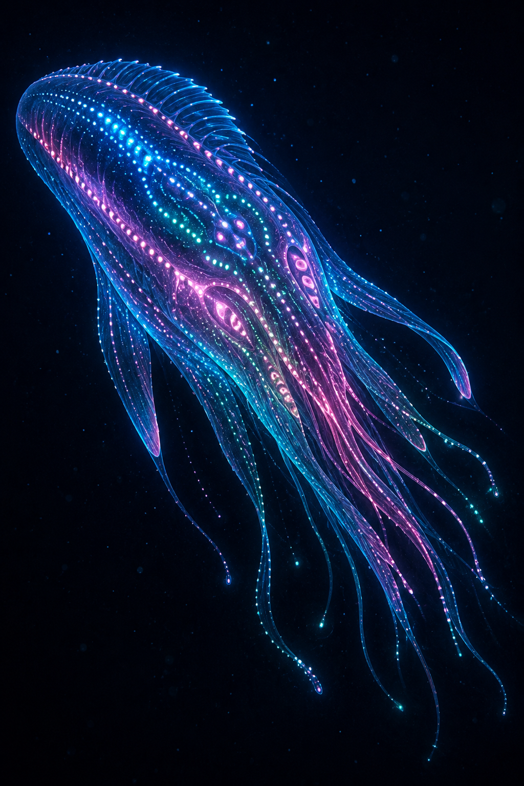

# Chapter 39: The Sentient Species Moryn

> *"Where light never reaches, where water weighs like stone — there they dance. Their dance is speech, their speech is color, their color is thought."*
> — Xha'Ruun Ambassador to the Moryn, +2 000 yr.

---

**Related sections:** → see [Ch.05, "Xha'Ruun"], → see [Ch.14, "Oceans"], → see [Vol.II, Ch.14, "History of the Three Species"], → see [Vol.VII, Ch.7, "Biology of Moryn"], → see [Vol.VIII, Ch.6, "Ocean Gharra"]
**Volume:** 30 pages

---

## Introduction

Moryn are the third sentient species of Théxar, inhabiting the lightless depths of the Gharra ocean. Where light never arrives and water pressure is measured in hundreds of atmospheres, the Moryn built a civilization founded not on sound and not on writing, but on the **light of their own bodies**.

Their existence is a living refutation of the idea that intelligence requires land, fire, and writing. → see [Vol.II, Ch.14, §14.3]

*Fig. 39.0. A Moryn individual in the depths of Gharra.*

---

## 39.1 Discovery and Status

| Event | Year (E.U.) |
|-------|-----------|
| First sightings (from fishing vessels, deep-water glow) | ~−3 000 |
| Confirmed contact (Research Guild bathyscaphe) | −1 200 |
| Establishment of permanent contact | −800 |
| Admission to the Council of Unity | +1 500 |

Before confirmed contact, the glow in Gharra's depths was explained for centuries as a natural phenomenon — the "abyssal lights" referenced in Kharak and Rhuval mythology. Only a Research Guild bathyscaphe descent in −1,200 recorded the deliberate, observer-responsive character of the glow.

---

## 39.2 Habitat

> **PROFILE: Moryn Habitat**
>
> | Parameter | Value |
> |-----------|-------|
> | Region | Deep zone of the Gharra ocean (Southern) |
> | Depth | 1,200–3,000 sha |
> | Pressure | 120–300 atm |
> | Temperature | 2–8°X |
> | Illumination | 0 (aphotic zone) |
> | Salinity | Elevated (bottom brine pools) |

Moryn avoid shelf and surface waters — their physiology is built for constant high pressure, and an ascent to the surface is lethal for an adult (decompression injury). Major settlements cluster around hydrothermal vents on the Gharra seafloor, which provide not only heat but chemical energy for the chemoautotrophic symbionts Moryn feed on. → see [Ch.14, §14.2, "Hydrothermal Vents"]

---

## 39.3 Biochemistry and Physiology

| Parameter | Value |
|-----------|-------|
| Cell membrane | Silicon-organic (withstands pressure of 300+ atm) |
| Metabolism | 3× slower than Xha'Ruun |
| Optimal temperature | 2–8°X |
| Energy source | Chemoautotrophic symbiotic bacteria + organic filtration |
| Pigmentation | None (no function in total absence of light) |

### 39.3.1 Pressure Resistance

The Moryn silicon-organic membrane is functionally analogous to the solution used by Kel'vash (→ see [Ch.38, §38.3.2]), but serves an opposite purpose: not protection against desiccation in a dry environment, but preservation of cellular integrity under enormous hydrostatic pressure. Moryn intracellular fluids are isosmotic with the surrounding environment — the organism does not "resist" pressure but balances it from within.

### 39.3.2 Slow Metabolism and Time

Moryn metabolism runs 3 times slower than Xha'Ruun — an adaptation to a cold, energy-poor environment. This directly shapes their perception of time: what looks to a Xha'Ruun observer like an unhurried "dance" of light patterns is, to the Moryn themselves, an ordinary pace of everyday conversation.

---

## 39.4 Bioluminescent Communication

> **KEY FACT**
>
> Moryn have no distinction between "speech" and "writing" in the usual sense. Their language is a sequence of color patterns generated by chromatophore organs across the body's surface, synchronized with movement. Xha'Ruun call it a "dance," but for the Moryn it is the only form of thought observable from outside.

| Language component | Mechanism | Xha'Ruun analogue |
|---------------------|-----------|---------------------|
| "Phonemes" | Discrete color flashes (7 base hues) | Sound phonemes |
| "Syntax" | Sequence and speed of color change | Word order |
| "Intonation" | Amplitude and area of the glow | Tone of voice |
| "Writing" | Long-duration bioluminescent marks on rock surfaces (used by some colonies) | Writing |

### 39.4.1 Bioluminescent Organs

The glow is produced by specialized chromatophore organs (analogous to luminophore cells) distributed unevenly across the body — densest on the dorsal side and around the sensory ridges. The emission spectrum ranges from deep blue (450 nm) to dark red (700 nm), and Moryn can distinguish hues inaccessible even to Xha'Ruun tetrachromatic vision with its UV channel (→ see [Ch.05, §5.4.1]) — their photoreceptors are adapted to extremely low light and can detect single photons.

---

## 39.5 Electroreception and Navigation

In total darkness, electroreception supplements bioluminescent vision as the primary channel of orientation:

| Application | Range | Precision |
|-------------|-------|-----------|
| Detecting another individual's "heartbeat" | up to 40 sha | High |
| Mapping seafloor terrain | up to 100 sha | Medium |
| Detecting hydrothermal vents (via electrochemical gradient) | up to 300 sha | High |

Moryn electroreceptor organs are an order of magnitude more sensitive than the rudimentary Xha'Ruun analogue (→ see [Ch.05, §5.4.4]) — an evolutionary necessity in an environment where neither sound nor sunlight was ever available.

---

## 39.6 Society and Culture

Because of their bioluminescent communication, Moryn lack a concept of "private," non-public thought as Xha'Ruun understand it — any glow is visible to everyone present simultaneously. This produced a strongly collectivist culture, perceived by Xha'Ruun observers as almost telepathic, in which:

- Decisions are made through synchronous "consonance" of color patterns across the whole group
- Individual privacy is expressed spatially (solitude = physical distance from the group) rather than informationally
- Moryn art and religion are built on multilayered light compositions that Xha'Ruun observers describe as "underwater symphonies of color"

**Lifespan:** estimated at 300–400 years — an intermediate value between Xha'Ruun (150–200) and Kel'vash (800–1,200), consistent with their intermediate metabolic rate.

---

## 39.7 Relations with Xha'Ruun and Kel'vash

Contact with the Moryn faces three main barriers (→ see [Vol.II, Ch.14, §14.3.3]):

1. **Language barrier** — translating between the Xha'Ruun sound-based language and the Moryn bioluminescent language requires specialized transluminator devices installed at the Council's deep-sea stations.
2. **Temporal barrier** — Moryn time perception (metabolism 3× slower) requires slowing dialogue roughly threefold for mutual understanding.
3. **Ethical barrier** — the collectivist, "transparent" Moryn ethic (where a hidden thought is physically impossible) sits uneasily with Xha'Ruun notions of personal autonomy and privacy.

Despite the barriers, the Moryn have been a full member of the Council of Unity since +1,500 yr., and no decision concerning Théxar's oceans is made without their participation.

---

## 39.8 Ecological Role

Moryn occupy the deep-sea chemosynthetic niche — an environment unavailable to photosynthetic life and extremely hostile to land-based forms. Their symbiosis with the chemoautotrophic bacteria of hydrothermal vents makes Moryn a key link in Gharra's benthic ecosystems, analogous to the Xha'Ruun role on land. → see [Ch.21, "Ecosystems"]

---

## Chapter Summary

**Key takeaways:**
1. Moryn are a silicon-membrane, cold-adapted sentient species of the Gharra ocean depths (1,200–3,000 sha).
2. Metabolism runs 3× slower than Xha'Ruun; ambient pressure is 120–300 atm.
3. Their language is bioluminescent color patterns synchronized with movement ("dance-speech").
4. Electroreception is the primary navigation channel in total darkness, an order of magnitude more sensitive than the Xha'Ruun analogue.
5. Society is collectivist — the public nature of thought makes individual privacy mostly spatial.
6. Lifespan: 300–400 years. Council of Unity member since +1,500 yr.

**Established facts (for CANON.md):**
- Habitat: Gharra ocean, 1,200–3,000 sha, pressure 120–300 atm, T 2–8°X — CONFIRMED
- Metabolism: 3× slower than Xha'Ruun — CONFIRMED (aligned with Vol.VII, Ch.7)
- Communication: bioluminescence, 7 base color "phonemes" — RECORDED
- Lifespan: 300–400 years — RECORDED
- Contact: −1,200 (confirmed), +1,500 (Council of Unity) — CONFIRMED (aligned with Vol.II, Ch.14)

**Related chapters:**
- → see [Ch.05, "Xha'Ruun"] — comparison of sensory systems
- → see [Ch.14, "Oceans"] — physical habitat
- → see [Ch.21, "Ecosystems"] — role in benthic ecosystems
- → see [Ch.40, "Three Species — Principle of Accord"] — comparative overview
- → see [Vol.II, Ch.14], [Vol.VII, Ch.7] and [Vol.VIII, Ch.6] — contact history, in-depth biology, and Ocean Gharra

---

*End of Chapter 39. Aligned with CANON.md v0.3.0 and Vol.VII, Ch.7.*
